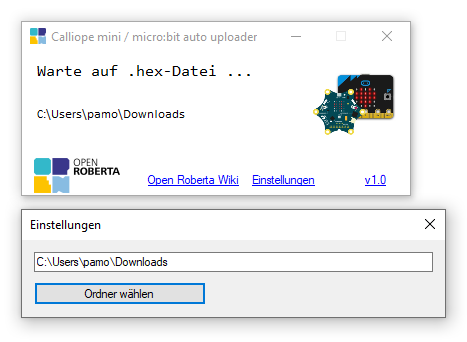

# Calliope mini / micro:bit / EV3 c4ev3 Autoupload

With this program you can automatically flash .HEX data to the Calliope mini and micro:bit and upload .UF2 data to the EV3 c4ev3.

## Function

This programm watches on a folder for hex/uf2 files and copy them to all connected Calliope minis, micro:bits or EV3 c4ev3s.

1. Download the .exe file from the releases.
2. Open the .exe file
3. The programm is watching the users downloads folder. You can change this by clicking on settings and select another folder.
4. Download your file into the watched folder

### Additional features

- You can manually select other folders to scan
- Copied files are renamed to \*.uploaded.\*

